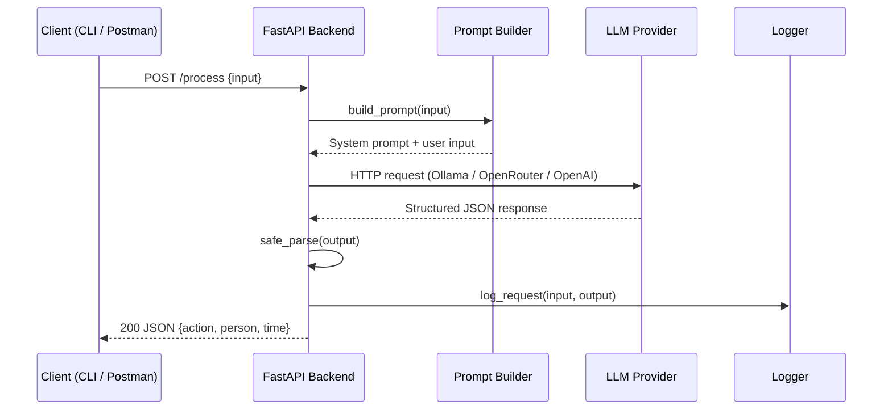

# llm-code-assistant-api

[](https://www.python.org/downloads/)
[](https://fastapi.tiangolo.com)
[](https://www.docker.com/)
[](https://opensource.org/licenses/MIT)
[](#)

Production-grade FastAPI service that accepts a code snippet or GitHub raw URL and returns LLM-generated explanations, documentation, or code reviews. Designed as a portfolio piece demonstrating structured JSON responses, multi-provider LLM routing, Docker deployment, and API engineering best practices.

---

## Table of Contents

- [Architecture](#architecture)
- [Prerequisites](#prerequisites)
- [Configuring LLM Providers](#configuring-llm-providers)
  - [Option 1: Ollama (Local, Free)](#option-1-ollama-local-free)
  - [Option 2: OpenRouter (Cloud API)](#option-2-openrouter-cloud-api)
  - [Option 3: OpenAI (Cloud API)](#option-3-openai-cloud-api)
- [Installation & Setup](#installation--setup)
- [Building & Running with Docker](#building--running-with-docker)
  - [Option A: Docker (build + run)](#option-a-docker-build--run)
  - [Option B: Docker Compose](#option-b-docker-compose)
  - [Option C: Host Networking for Ollama](#option-c-host-networking-for-ollama)
- [API Endpoints](#api-endpoints)
- [Testing](#testing)
- [Project Structure](#project-structure)
- [Environment Variables](#environment-variables)
- [Performance & Cost Considerations](#performance--cost-considerations)
- [Future Improvements](#future-improvements)
- [Acknowledgments](#acknowledgments)
- [License](#license)

---

## Architecture



### Tech Stack

- **Python 3.11+** with type hints and Pydantic v2
- **[FastAPI](https://fastapi.tiangolo.com/)** for the async web framework
- **[Uvicorn](https://www.uvicorn.org/)** ASGI server
- **Docker** for containerized deployment
- **LLM Providers**: Ollama (local), OpenRouter (API), OpenAI (optional)
- **`requests`** / **`openai`** for provider communication
- **`pytest`** for unit testing

---

## Prerequisites

- [Docker](https://www.docker.com/get-started/)
- One of the following LLM backends (see [Configuring LLM Providers](#configuring-llm-providers) below):
  - **Ollama** running locally
  - **OpenRouter** API key
  - **OpenAI** API key

---

## Configuring LLM Providers

Set your provider and API keys in the `.env` file **before** building or running the Docker container.

Start with a `.env` file in the project root:

```env
LLM_PROVIDER=ollama
OPENROUTER_API_KEY=
OPENAI_API_KEY=
```

### Option 1: Ollama (Local, Free)

1. [Install Ollama](https://ollama.com/download) and start the service.
2. Pull the `llama3` model:

```bash
ollama pull llama3
```

3. Set the provider in `.env`:

```env
LLM_PROVIDER=ollama
```

> **Docker note:** The FastAPI container needs to reach Ollama at `localhost:11434`. On Linux, use `--network host` when running the container (see [Option C](#option-c-host-networking-for-ollama) below).

### Option 2: OpenRouter (Cloud API)

1. Get a free API key from [openrouter.ai](https://openrouter.ai/).
2. Set the provider and key in `.env`:

```env
LLM_PROVIDER=openrouter
OPENROUTER_API_KEY=sk-or-v1-your-api-key-here
```

### Option 3: OpenAI (Cloud API)

1. Get an API key from [platform.openai.com](https://platform.openai.com/).
2. Set the provider and key in `.env`:

```env
LLM_PROVIDER=openai
OPENAI_API_KEY=sk-proj-your-api-key-here
```

---

## Installation & Setup

```bash
git clone https://github.com/yourusername/llm-code-assistant.git
cd llm-code-assistant
```

Edit the `.env` file with your chosen provider (see [Configuring LLM Providers](#configuring-llm-providers) above), then build and run with Docker.

---

## Building & Running with Docker

### Option A: Docker (build + run)

```bash
# 1. Build the image
docker build -t ai-llm-api .

# 2. Run the container (passes .env variables into the container)
docker run -d --name ai-llm-api -p 8000:8000 --env-file .env ai-llm-api
```

The API will be available at `http://localhost:8000`. Swagger docs at `http://localhost:8000/docs`.

To stop and remove:

```bash
docker stop ai-llm-api
docker rm ai-llm-api
```

### Option B: Docker Compose

```yaml
# docker-compose.yml
services:
  api:
    build: .
    ports:
      - "8000:8000"
    env_file: .env
    restart: unless-stopped
```

```bash
docker compose up -d --build
```

### Option C: Host Networking for Ollama

If you use **Ollama** as the provider on Linux, the container must share the host network to reach `localhost:11434`:

```bash
docker run -d --name ai-llm-api --network host --env-file .env ai-llm-api
```

On macOS or Windows with Docker Desktop, `host.docker.internal` can be used as the Ollama host instead — edit `llm_service.py` and replace `localhost:11434` with `host.docker.internal:11434`.

---

## API Endpoints

### `POST /process`

Accepts free-form text and returns a structured JSON extraction.

**Request body:**

| Field  | Type   | Required | Description          |
|--------|--------|----------|----------------------|
| input  | string | Yes      | Free-form text input |

**Response:**

```json
{
  "action": "schedule_meeting",
  "person": "Ali",
  "time": "2026-04-23T15:00:00"
}
```

**Example:**

```bash
curl -X POST http://localhost:8000/process \
  -H "Content-Type: application/json" \
  -d '{"input": "Schedule a meeting with Ali tomorrow at 3pm"}'
```

### `GET /docs`

Auto-generated Swagger UI for interactive API exploration.

---

## Testing

```bash
pytest tests/ -v
```

The test suite covers:

- Successful JSON extraction via mocked LLM calls
- Schema validation (error on missing fields)
- Provider routing logic
- Fallback behavior on malformed LLM output

---

## Project Structure

```
ai-llm-api/

app/
  main.py                   # FastAPI app entry point
  api/
    routes.py               # HTTP endpoint handlers
  core/
    config.py               # Configuration via environment variables
    logger.py               # Centralized logging
  services/
    llm_service.py          # Multi-provider LLM client (Ollama, OpenRouter, OpenAI)
  schemas/
    request_response.py     # Pydantic v2 request/response models
  utils/
    prompt_builder.py       # System prompt construction for structured JSON output
tests/
  test_api.py               # Unit tests with mocked LLM responses
.env                        # Environment variables (gitignored)
.env.example                # Template for .env
Dockerfile                  # Production container build
requirements.txt            # Python dependencies
README.md                   # This file
```

---

## Environment Variables

| Variable            | Default    | Required | Description                              |
|---------------------|------------|----------|------------------------------------------|
| `LLM_PROVIDER`      | `ollama`   | No       | Provider: `ollama`, `openrouter`, `openai` |
| `OPENROUTER_API_KEY`| _(empty)_  | Yes\*    | API key for OpenRouter (required if `LLM_PROVIDER=openrouter`) |
| `OPENAI_API_KEY`    | _(empty)_  | Yes\*    | API key for OpenAI (required if `LLM_PROVIDER=openai`) |

---

## Performance & Cost Considerations

- **Ollama (local):** Zero inference cost. Latency depends on available CPU/GPU. Suitable for development and local testing.
- **OpenRouter:** Pay-per-token pricing. The Mistral 7B model used in the default configuration costs a fraction of a cent per request.
- **OpenAI GPT-4o-mini:** ~[TODO] $0.15 / 1M input tokens, $0.60 / 1M output tokens. A typical structured extraction costs < $0.002 per call.
- **Token usage:** The service does not currently track tokens natively. A future enhancement will add token counting via `tiktoken` and cost estimation in API responses.

---

## Future Improvements

- [ ] **Rate limiting** via `slowapi` or middleware
- [ ] **Response caching** with Redis for repeated inputs
- [ ] **Token usage tracking** and cost reporting in every response
- [ ] **Streaming mode** (`POST /process?stream=true`) for real-time output
- [ ] **Health check endpoint** (`GET /health`) for container orchestration
- [ ] **Support for additional providers** (Anthropic, Google Gemini, Hugging Face Inference)
- [ ] **Docker Compose** for multi-service orchestration (API + Ollama + Redis)
- [ ] **CI/CD pipeline** with GitHub Actions for automated testing and deployment

---

## Acknowledgments

This project was built as part of my effort to demonstrate production AI engineering skills. It draws on experience from prior work:

- **TU Berlin MSc Computer Science** thesis on Deep Reinforcement Learning for Hemodynamic Response Modeling.
- Sentiment analysis project using Random Forest classification with a Flask/React frontend on movie reviews.

---

## License

[MIT](LICENSE) &mdash; built by Wagdi Mohammed
