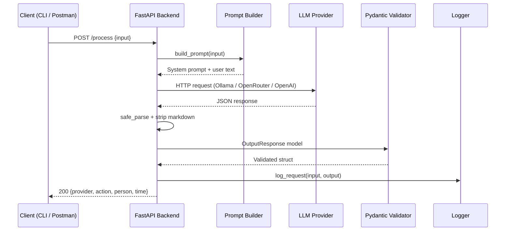

# ai-llm-api

[](https://www.python.org/downloads/)
[](https://fastapi.tiangolo.com)
[](https://www.docker.com/)
[](https://opensource.org/licenses/MIT)

Production-grade FastAPI service that accepts free-form natural language input and returns structured JSON — extracted by an LLM. Supports multiple providers (Ollama, OpenRouter, OpenAI) with automatic fallback, Pydantic schema validation, Docker deployment, and Swagger docs out of the box.

Built as a portfolio piece demonstrating production API engineering, multi-provider LLM routing, and structured output design.

---

## Table of Contents

- [Architecture](#architecture)
- [Prerequisites](#prerequisites)
- [Configuring LLM Providers](#configuring-llm-providers)
  - [Option 1: Ollama (Local, Free)](#option-1-ollama-local-free)
  - [Option 2: OpenRouter (Cloud API)](#option-2-openrouter-cloud-api)
  - [Option 3: OpenAI (Cloud API)](#option-3-openai-cloud-api)
- [Installation & Setup](#installation--setup)
- [Building & Running with Docker](#building--running-with-docker)
  - [Option A: Docker (build + run)](#option-a-docker-build--run)
  - [Option B: Docker Compose](#option-b-docker-compose)
  - [Option C: Host Networking for Ollama](#option-c-host-networking-for-ollama)
- [API Endpoints](#api-endpoints)
- [Testing](#testing)
- [Project Structure](#project-structure)
- [Environment Variables](#environment-variables)
- [Performance & Cost Considerations](#performance--cost-considerations)
- [Future Improvements](#future-improvements)
- [Acknowledgments](#acknowledgments)
- [License](#license)

---

## Architecture



### Tech Stack

- **Python 3.11+** with type hints and Pydantic v2
- **[FastAPI](https://fastapi.tiangolo.com/)** for the async web framework
- **[Uvicorn](https://www.uvicorn.org/)** ASGI server
- **Docker** for containerized deployment
- **LLM Providers**: Ollama (local), OpenRouter (API), OpenAI (optional)
- **Automatic fallback** between providers on failure
- **`pytest`** for unit testing

### Key Features

- Strict JSON output enforced via constrained prompts
- Pydantic `Literal` enum validation (`call`, `meeting`, `email`, `task`)
- Provider visibility in every response
- Automatic fallback: primary provider → secondary → tertiary
- Markdown code-fence stripping (` ```json ... ``` ` → raw JSON)
- Docker container with `--env-file` configuration

---

## Prerequisites

- [Docker](https://www.docker.com/get-started/)
- One of the following LLM backends:
  - **Ollama** running locally
  - **OpenRouter** API key
  - **OpenAI** API key

---

## Configuring LLM Providers

Create a `.env` file in the project root and choose your primary provider.

### Option 1: Ollama (Local, Free)

1. [Install Ollama](https://ollama.com/download) and start the service.
2. Pull a model:

```bash
ollama pull llama3
```

3. Set the provider in `.env`:

```env
LLM_PROVIDER=ollama
```

> The FastAPI container needs to reach Ollama at `localhost:11434`. On Linux, use `--network host` (see [Option C](#option-c-host-networking-for-ollama)).

### Option 2: OpenRouter (Cloud API)

1. Get a free API key from [openrouter.ai](https://openrouter.ai/).
2. Set provider and key in `.env`:

```env
LLM_PROVIDER=openrouter
OPENROUTER_API_KEY=sk-or-v1-your-api-key-here
```

You can also set `OPENROUTER_MODEL` to choose a specific model (default: `openrouter/free`).

### Option 3: OpenAI (Cloud API)

1. Get an API key from [platform.openai.com](https://platform.openai.com/).
2. Set provider and key in `.env`:

```env
LLM_PROVIDER=openai
OPENAI_API_KEY=sk-proj-your-api-key-here
```

You can also set `OPENAI_MODEL` to choose a specific model (default: `gpt-4o-mini`).

---

## Installation & Setup

```bash
git clone https://github.com/wa7med/ai-llm-api.git
cd ai-llm-api
```

Create your `.env` file with the chosen provider and keys (see above), then build and run with Docker.

---

## Building & Running with Docker

### Option A: Docker (build + run)

```bash
# 1. Build the image
docker build -t ai-llm-api .

# 2. Run the container
docker run -d --name ai-llm-api -p 8000:8000 --env-file .env ai-llm-api
```

The API will be at `http://localhost:8000`. Swagger docs at `http://localhost:8000/docs`.

```bash
docker stop ai-llm-api && docker rm ai-llm-api
```

### Option B: Docker Compose

```yaml
# docker-compose.yml
services:
  api:
    build: .
    ports:
      - "8000:8000"
    env_file: .env
    restart: unless-stopped
```

```bash
docker compose up -d --build
```

### Option C: Host Networking for Ollama

If using **Ollama** on Linux, share the host network so the container can reach `localhost:11434`:

```bash
docker run -d --name ai-llm-api --network host --env-file .env ai-llm-api
```

---

## API Endpoints

### `POST /process`

Accepts free-form text and returns structured JSON with validated fields.

**Request:**

```json
{
  "input": "Schedule a meeting with Ali tomorrow at 3pm"
}
```

**Response:**

```json
{
  "provider": "openrouter",
  "action": "meeting",
  "person": "Ali",
  "time": "2026-04-23T15:00:00"
}
```

**Fields:**

| Field      | Type   | Description                                    |
|------------|--------|------------------------------------------------|
| `provider` | string | Which LLM provider handled the request           |
| `action`   | string | One of: `call`, `meeting`, `email`, `task`       |
| `person`   | string | Extracted name, or `null`                        |
| `time`     | string | ISO datetime string, or `null`                   |

**Example curl:**

```bash
curl -X POST http://localhost:8000/process \
  -H "Content-Type: application/json" \
  -d '{"input": "Schedule a meeting with Ali tomorrow at 3pm"}'
```

### `GET /docs`

Auto-generated Swagger UI for interactive API exploration.

---

## Testing

```bash
pytest tests/ -v
```

The test suite covers:

- Successful JSON extraction via mocked LLM calls
- Pydantic schema validation (rejects invalid action values)
- Provider routing and response structure
- Fallback behavior on malformed LLM output

---

## Project Structure

```
ai-llm-api/
├── app/
│   ├── main.py                  # FastAPI app entry point
│   ├── api/
│   │   └── routes.py            # HTTP endpoint handlers
│   ├── core/
│   │   ├── config.py            # Configuration via environment variables
│   │   └── logger.py            # Standalone logging utility
│   ├── services/
│   │   └── llm_service.py       # Multi-provider LLM client with fallback
│   ├── schemas/
│   │   └── request_response.py  # Pydantic v2 models + log_request helper
│   └── utils/
│       └── prompt_builder.py    # System prompt for structured JSON
├── tests/
│   └── test_api.py              # Unit tests with mocked LLM responses
├── .env                         # Environment variables (gitignored)
├── .gitignore
├── Dockerfile                   # Production container build
├── requirements.txt             # Python dependencies
└── README.md
```

---

## Environment Variables

| Variable            | Default              | Required | Description                                        |
|---------------------|----------------------|----------|----------------------------------------------------|
| `LLM_PROVIDER`      | `ollama`             | No       | Primary provider: `ollama`, `openrouter`, `openai` |
| `OPENROUTER_API_KEY`| _(empty)_            | If `openrouter` | API key for OpenRouter                        |
| `OPENROUTER_MODEL`  | `openrouter/free`    | No       | OpenRouter model name                              |
| `OPENAI_API_KEY`    | _(empty)_            | If `openai`    | API key for OpenAI                            |
| `OPENAI_MODEL`      | `gpt-4o-mini`        | No       | OpenAI model name                                  |
| `OLLAMA_MODEL`      | `llama3`             | No       | Ollama model name                                  |
| `OLLAMA_BASE_URL`   | `http://localhost:11434` | No   | Ollama server URL                                  |

---

## Performance & Cost Considerations

- **Ollama (local):** Zero inference cost. Latency depends on available CPU/GPU. Run `ollama pull llama3` before starting.
- **OpenRouter:** The `openrouter/free` router costs nothing. Paid models like Mistral 7B cost a fraction of a cent per request.
- **OpenAI GPT-4o-mini:** ~$0.15 / 1M input tokens, $0.60 / 1M output tokens. A typical extraction costs < $0.002 per call.
- **Token usage:** Not tracked natively yet. A future enhancement will add `tiktoken` counting and cost reporting in responses.

---

## Future Improvements

- [ ] **Rate limiting** via `slowapi` or middleware
- [ ] **Response caching** with Redis for repeated inputs
- [ ] **Token usage tracking** and cost reporting
- [ ] **Streaming mode** (`POST /process?stream=true`)
- [ ] **Health check endpoint** (`GET /health`)
- [ ] **Additional providers** (Anthropic, Google Gemini, Hugging Face)
- [ ] **Docker Compose** for API + Ollama + Redis
- [ ] **CI/CD pipeline** with GitHub Actions

---

## Acknowledgments

This project was built to demonstrate production AI engineering skills. It draws on experience from prior work:

- **TU Berlin MSc Computer Science** thesis on Deep Reinforcement Learning for Hemodynamic Response Modeling.
- Sentiment analysis project using Random Forest classification with a Flask/React frontend on movie reviews.

---

## License

[MIT](LICENSE) — built by Wagdi Mohammed
